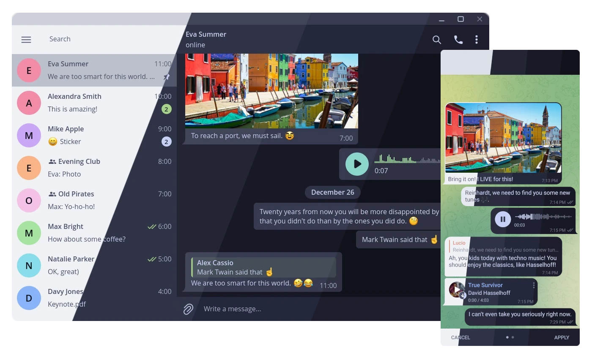
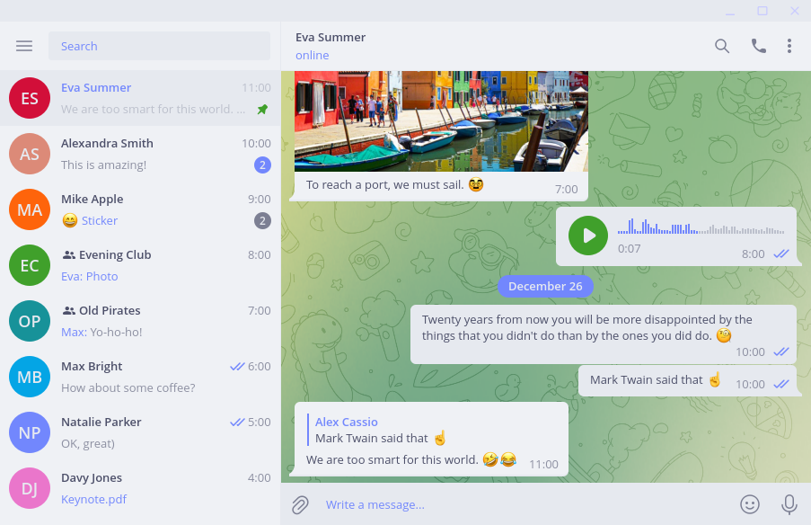
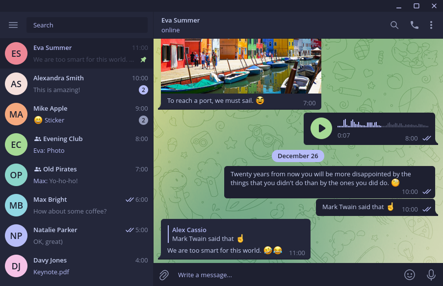
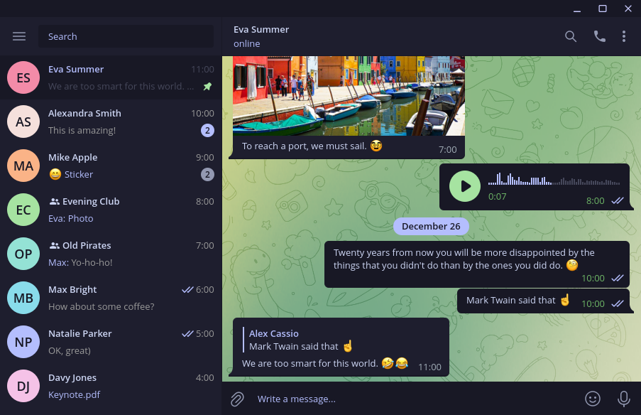
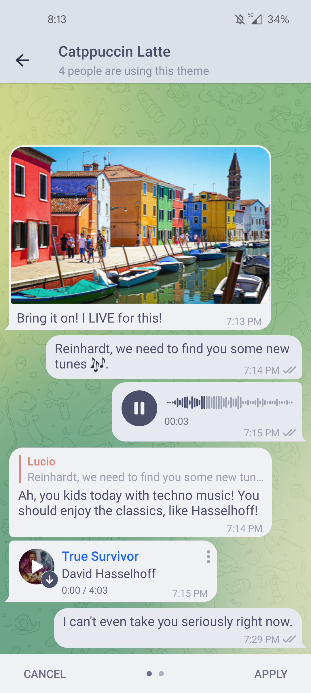
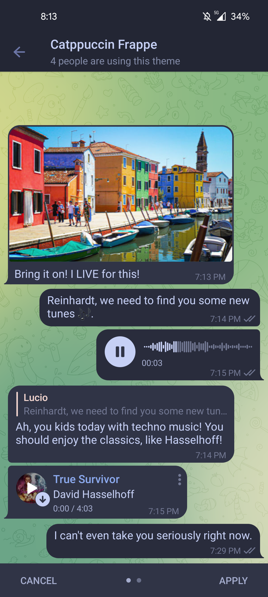
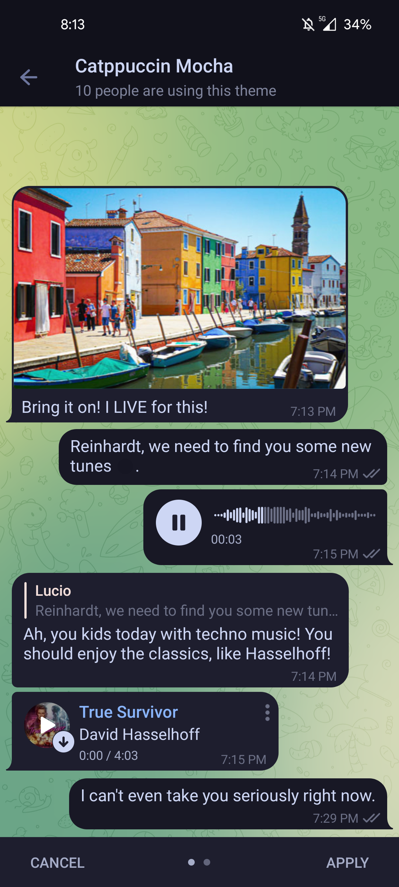

<h3 align="center">
	 
	
	Catppuccin for <a href="https://telegram.org">Telegram</a>
	
</h3>

    
    
    

  

## Previews

🖥 Desktop

🌻 Latte

🪴 Frappé

🌺 Macchiato

🌿 Mocha

📱 Mobile

🌻 Latte

🪴 Frappé

🌺 Macchiato

🌿 Mocha

## Usage

* [🌻 Latte](https://t.me/addtheme/ctp_latte)
* [🪴 Frappé](https://t.me/addtheme/ctp_frappe)
* [🌺 Macchiato](https://t.me/addtheme/ctp_macchiato)
* [🌿 Mocha](https://t.me/addtheme/ctp_mocha)

1. Chose your flavour from the list above
2. Open the link with your Telegram client of choice
4. Apply the theme
5. Enjoy! 

## 🐱 Development (for the desktop version)

- The desktop version uses Go to build files for all flavours. To build a flavour, run `go run main.go --color <flavour-name>`. This creates a desktop theme file inside `src/<flavour-name>/<flavour-name>_desktop`.
- You are supposed to change the colours inside the `build/template.go.tpl` file. 
- Rebuild flavours after editing the template file. 

## 💝 Thanks to

- [Andreas Grafen](https://github.com/andreasgrafen)
- [ghostx31](https://github.com/ghostx31)
- [Name](https://github.com/NamesCode)
- [jasoncrevier](https://github.com/jasoncrevier)

&nbsp;

Copyright &copy; 2021-present <a href="https://github.com/catppuccin" target="_blank">Catppuccin Org</a>

